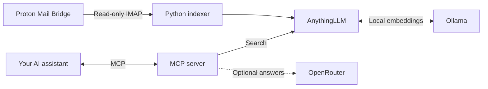

<p align="center">
  
</p>

<p align="center">
  <a href="https://github.com/waf1102/proton-rag-mcp/actions/workflows/checks.yml"></a>
  
  
  
</p>

<p align="center">
  <a href="#requirements">Requirements</a> ·
  <a href="#get-started">Get started</a> ·
  <a href="#connect-your-ai-assistant">Connect your assistant</a> ·
  <a href="#documentation">Documentation</a>
</p>

**Search your Proton Mail in plain language from Claude Code, Cursor, or VS Code.** Find messages and attachments, trace results back to their sources, and optionally generate answers with OpenRouter.

> “Find the invoice for my last laptop purchase.”<br>
> “What did the contractor say about the delivery date?”<br>
> “Find the email with the signed agreement attached.”

- **Search across folders** — index all selectable folders, or choose your own.
- **Find text in attachments** — includes supported PDF and DOCX files.
- **Keep mail untouched** — no sending, deleting, moving, or marking messages as read.
- **See where answers came from** — results include subjects, senders, dates, and source citations.
- **Pick up where you left off** — incremental indexing resumes after interruptions.

## How it works



Indexing and retrieval run on your machine. Search results are then shared with the assistant you connect, so that assistant's data policies apply. Enabling `answer_mail` also sends selected excerpts and your question to OpenRouter. [More about data storage and privacy →](docs/security.md)

## Requirements

| You need | Details |
| --- | --- |
| **Linux** | Run Bridge, the indexer, and the MCP server on the same host. The client examples below assume the client also runs there. |
| **Proton Mail Bridge** | A [paid Proton Mail plan with Bridge access](https://proton.me/support/protonmail-bridge-install), Bridge installed and signed in, and its IMAP credentials. Use IMAP **STARTTLS** mode. |
| **Python 3.11+ and uv** | Install [Python](https://www.python.org/downloads/) and [uv](https://docs.astral.sh/uv/getting-started/installation/). |
| **Docker Engine + Compose v2** | Follow [Docker's installation guide](https://docs.docker.com/engine/install/). Your user must be able to run `docker compose`. [Rootless Podman](docs/podman.md) is also supported. |
| **Git, Bash, and OpenSSL** | Used by the setup commands below. |
| **Memory and storage** | Budget roughly **3 GiB of available RAM** for this stack, plus disk space for images, the embedding model, and your mail index. Storage grows with mailbox size. |
| **An MCP client** | Claude Code, Cursor, VS Code with Copilot, or another client that can launch a local stdio server. |

**Optional:** an [OpenRouter API key](https://openrouter.ai/settings/keys) with available credits for `answer_mail`. Search works without one. A GPU and a local chat model are not required.

## Get started

Docker Compose runs **AnythingLLM and Ollama**. The Python indexer and MCP server run on the host alongside Bridge.

### 1. Download and install

```bash
git clone https://github.com/waf1102/proton-rag-mcp.git
cd proton-rag-mcp
uv sync --locked
```

### 2. Start the local index

Create AnythingLLM's private service secrets. This preserves the file if you already have one:

```bash
umask 077
mkdir -p "$HOME/.config/proton-rag"
if [ ! -f "$HOME/.config/proton-rag/anything.env" ]; then
  printf 'AUTH_TOKEN=%s\nJWT_SECRET=%s\n' \
    "$(openssl rand -hex 32)" "$(openssl rand -hex 32)" \
    > "$HOME/.config/proton-rag/anything.env"
fi
```

Start the services and download the embedding model:

```bash
cd deploy
docker compose up -d --wait ollama
docker compose exec ollama ollama pull nomic-embed-text
docker compose up -d --wait
cd ..
```

Open **[AnythingLLM at localhost:3001](http://127.0.0.1:3001)**, sign in using the `AUTH_TOKEN` value from `~/.config/proton-rag/anything.env` if prompted for a password, and complete setup. Create an API key under **Settings → Developer API**. Save that key for the next step. Keep Ollama / `nomic-embed-text` as the embedding provider and model configured by Compose.

Prefer Podman? Use the [Podman guide](docs/podman.md) for this step, then continue below.

### 3. Connect Proton Mail

In Bridge, open your account's mailbox configuration and copy its **IMAP username and password**. These are separate from your Proton login password.

Export Bridge's TLS certificate from **Settings → Advanced settings → Export TLS certificates** ([Proton's guide](https://proton.me/support/comprehensive-guide-to-bridge-settings)). Save the certificate as `~/.config/proton-rag/bridge-ca.pem`. This application needs the certificate, not the exported private key.

Create `~/.config/proton-rag/mail.env` in your editor with the following values. Replace `YOUR_USER` and the three credential placeholders; use the IMAP host and port shown by Bridge if they differ.

```bash
RAG_STATE_DIR='/home/YOUR_USER/.local/share/proton-rag/mail'
ANYTHING_URL='http://127.0.0.1:3001'
ANYTHING_WORKSPACE='proton-mail'
ANYTHING_API_KEY='YOUR_ANYTHINGLLM_API_KEY'
IMAP_HOST='127.0.0.1'
IMAP_PORT='1143'
IMAP_CA_FILE='/home/YOUR_USER/.config/proton-rag/bridge-ca.pem'
IMAP_USER='YOUR_BRIDGE_USERNAME'
IMAP_PASS='YOUR_BRIDGE_PASSWORD'
```

Protect the file, then load it into your Bash session:

```bash
chmod 600 "$HOME/.config/proton-rag/mail.env"
set -a
source "$HOME/.config/proton-rag/mail.env"
set +a
```

### 4. Start indexing

From the repository root, in the same terminal:

```bash
uv run python scripts/bootstrap-workspace.py
uv run proton-rag
```

Leave this running while you connect your assistant in another terminal. **You can search as messages become indexed**; you do not need to wait for the entire mailbox. The first import can take a while for large accounts. Later syncs fetch new messages and resume saved progress.

All selectable folders are included by default. To choose folders, add either of these settings to `mail.env` before starting the indexer:

```bash
# Index only these folders:
RAG_FOLDERS='["INBOX", "Folders/Work"]'

# Or keep all folders except these:
RAG_EXCLUDED_FOLDERS='["Trash", "Spam"]'
```

Use your exact Bridge folder names. If both settings are present, exclusions take precedence. For unattended indexing, follow the [background service guide](docs/operations.md#background-service).

## Connect your AI assistant

The client launches the MCP server automatically. **Keep the indexer running separately** to pick up new mail.

Choose a client below. Replace `/home/YOUR_USER/proton-rag-mcp` with your checkout's absolute path and use the same API key, state directory, and workspace as above. Run `pwd` from the repository root to find your checkout path. Do not use `~` in JSON paths.

<details>
<summary><strong>Claude Code</strong></summary>

In a new Bash terminal, enter the repository directory, then load your configuration and register the server for your user:

```bash
cd /home/YOUR_USER/proton-rag-mcp
set -a
source "$HOME/.config/proton-rag/mail.env"
set +a

claude mcp add --scope user \
  --env ANYTHING_API_KEY="$ANYTHING_API_KEY" \
  --env ANYTHING_URL="$ANYTHING_URL" \
  --env ANYTHING_WORKSPACE="$ANYTHING_WORKSPACE" \
  --env RAG_STATE_DIR="$RAG_STATE_DIR" \
  --transport stdio proton-mail -- "$PWD/.venv/bin/proton-rag-mcp"
```

Open Claude Code and run `/mcp` to confirm `proton-mail` is connected. [Claude Code MCP documentation](https://code.claude.com/docs/en/mcp).

</details>

<details>
<summary><strong>Cursor</strong></summary>

Add this server to your personal `~/.cursor/mcp.json` file. If the file already contains servers, merge the `proton-mail` entry into its `mcpServers` object.

```json
{
  "mcpServers": {
    "proton-mail": {
      "command": "/home/YOUR_USER/proton-rag-mcp/.venv/bin/proton-rag-mcp",
      "env": {
        "ANYTHING_API_KEY": "YOUR_ANYTHINGLLM_API_KEY",
        "ANYTHING_URL": "http://127.0.0.1:3001",
        "ANYTHING_WORKSPACE": "proton-mail",
        "RAG_STATE_DIR": "/home/YOUR_USER/.local/share/proton-rag/mail"
      }
    }
  }
}
```

Save the file, restart Cursor, and enable `proton-mail` in its MCP settings. The tools are available to Agent. [Cursor MCP documentation](https://prod.cursor.com/help/customization/mcp).

</details>

<details>
<summary><strong>VS Code with GitHub Copilot</strong></summary>

Open the Command Palette and run **MCP: Open User Configuration**. Add this server and the password input to your user configuration, preserving any existing entries:

```json
{
  "servers": {
    "proton-mail": {
      "type": "stdio",
      "command": "/home/YOUR_USER/proton-rag-mcp/.venv/bin/proton-rag-mcp",
      "env": {
        "ANYTHING_API_KEY": "${input:proton-anything-key}",
        "ANYTHING_URL": "http://127.0.0.1:3001",
        "ANYTHING_WORKSPACE": "proton-mail",
        "RAG_STATE_DIR": "/home/YOUR_USER/.local/share/proton-rag/mail"
      }
    }
  },
  "inputs": [
    {
      "id": "proton-anything-key",
      "type": "promptString",
      "description": "AnythingLLM API key for Proton Mail",
      "password": true
    }
  ]
}
```

Start the server from the configuration editor, enter your AnythingLLM key when prompted, and enable its tools in Copilot Chat's Agent mode. [VS Code MCP documentation](https://code.visualstudio.com/docs/agent-customization/mcp-servers).

</details>

Client configurations only need access to the local index; do not add your Bridge password. Keep API keys in personal configuration, outside Git.

### Try it

Ask your assistant:

> Use `search_mail` to find emails about my upcoming trip. Include the sender, date, and source for each result.

| Tool | What it does | Needs OpenRouter? |
| --- | --- | --- |
| `search_mail` | Finds indexed messages and returns excerpts, metadata, and citations. | No |
| `answer_mail` | Generates an answer from selected excerpts, with citations. | Yes |

Citations identify messages in your index; they are not clickable Proton Mail links. PDF and DOCX text extraction is supported; scanned images need OCR before their text can be searched.

### Optional: enable OpenRouter answers

Add `OPENROUTER_API_KEY` to the MCP server's environment in your client configuration. For Cursor or VS Code, add these entries inside the server's `env` object (use a password input in VS Code if preferred):

```json
"OPENROUTER_API_KEY": "YOUR_OPENROUTER_API_KEY",
"OPENROUTER_MODEL": "openai/gpt-4.1-mini"
```

For Claude Code, include an additional `--env OPENROUTER_API_KEY="$OPENROUTER_API_KEY"` when registering the server, after setting that variable in your shell. To update an existing registration, run `claude mcp remove --scope user proton-mail` and repeat the registration command with the extra option.

Restart the MCP server in your client. `answer_mail` will appear alongside `search_mail`. The model above is the default; you can choose another OpenRouter model. OpenRouter usage is billed to your account. Your assistant can already use search results in its own replies without enabling this extra tool.

## Documentation

| Guide | What you'll find |
| --- | --- |
| [Configuration & operations](docs/operations.md) | All environment variables, background services, upgrades, and backups. |
| [Podman setup](docs/podman.md) | Rootless containers with systemd Quadlet. |
| [Privacy & security](docs/security.md) | Mail access, local storage, and what leaves your machine. |
| [Fedora deployment](docs/fedora.md) | Fedora-specific setup and migration notes. |
| [Validation](docs/validation.md) | Test commands, live checks, and deployment coverage. |

## Contributing

Bug reports and focused pull requests are welcome. Include reproduction steps and redact mail contents and credentials from logs. See [Validation](docs/validation.md) for the development checks.
