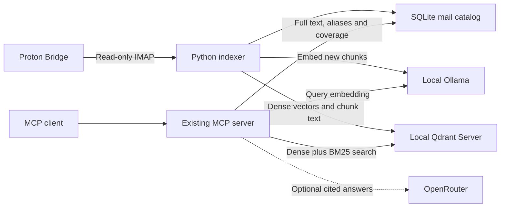

# Replace AnythingLLM with Qdrant

Status: proposed design for review; planning only. No running services or production data have been changed.

## Intent and constraints

Replace AnythingLLM with a lighter local service dedicated to mail retrieval. Choose the database for the workload, independently of how easy its migration is. Preserve existing extracted text, metadata, stable message IDs, historical aliases, folder memberships, citations, and indexing progress. Reuse embeddings when their provenance and completeness can be verified; rebuild from cached text otherwise. The mailbox does not need to finish indexing first.

Continue the established product behavior: read-only Bridge access, local retrieval, paginated full-message reading, honest incomplete-coverage reporting, and optional OpenRouter answers. The prior setup history is locally named `proton-rag-mcp project init`; its last migration discussion confirms preservation of the application's catalog rather than restarting mailbox ingestion.

## Observed installation, October 9, 2026

Read-only observations around 17:09 UTC; repeat the audit before migration because these values are snapshots.

| Item | Observation |
| --- | --- |
| Application checkout | `main`, commit `b2c3355`; existing separate worktrees must be preserved |
| Canonical messages / cached texts | 6,108 / 6,108 |
| Nonempty / empty cached texts | 6,083 / 25 |
| Folder memberships / aliases | 10,345 / 10,345 |
| Inactive membership entries | 1; preserve its state and reconcile it after cutover |
| Last observed folder inventory | 62,968 entries across 12 folders; these are appearances, not unique messages |
| Completed folders | 8; overall coverage remains incomplete |
| AnythingLLM backend | LanceDB; 22,744 chunks, 768-dimensional float32 vectors |
| Backend source coverage | All 6,083 active nonempty messages have chunks; 6,085 source IDs map to 6,083 canonical IDs, including two legacy aliases |
| Embeddings | Ollama `nomic-embed-text`, context setting 2,048; installed adapter sends unprefixed input |
| Lance table versions | 4,120 |
| Backend volume | About 842 MiB, including 522 MiB LanceDB and 255 MiB vector cache |
| Catalog directory | About 100 MiB, including the pre-dedup backup |
| Host storage | About 2 GiB free on a 47 GiB filesystem |
| Runtime | Daemon and backend services active; persisted indexing state paused with `low_disk` |

The source coverage audit does not prove vector validity, model immutability, or chunk completeness. Those require the export/import validation below. No mailbox bodies, credentials, or private excerpts belong in committed artifacts.

## Database choice

**Recommend a single local Qdrant Server**, retaining SQLite as the application's authoritative mail catalog and Ollama as its dense embedder.

| Option | Fit and tradeoff |
| --- | --- |
| Qdrant Server | Dedicated retrieval engine; deterministic point upserts, automatic background indexing/optimization, snapshots, and native dense plus BM25 hybrid retrieval. One service shared by the daemon and multiple MCP processes. Recommended. |
| Direct embedded LanceDB | Lowest service count and capable vector/full-text search. Viable, but the application must manage table refresh across processes, batching, version cleanup, and index maintenance. Existing format compatibility is useful but does not determine the recommendation. |
| SQLite vector extension | Smallest storage stack, but introduces extension-specific lifecycle and scaling decisions. `sqlite-vec` is still documented as pre-v1. Less attractive for this already substantial, growing chunk index. |

Qdrant Edge was also considered: it removes the server but exposes manual optimization and different snapshot behavior. The current separate indexer and multiple MCP readers favor the server's shared ownership and background maintenance.

Resource savings are an expectation to measure, not an established result. Ollama's embedding cost remains, and migration temporarily needs extra storage. Choose release `1.19.2` as the investigated baseline, pin its image digest during implementation, and verify local BM25 capability on that exact image. Use disk-backed vectors/payloads and conservative background optimization; tune against measured RAM and search latency. Keep the original float32 vectors; do not add lossy quantization during this migration.

## Architecture

SQLite owns identity, text, locations, scope, ingestion intent, and per-message index manifests. Qdrant owns searchable chunks, dense vectors, BM25 sparse vectors, and search indexes. The Python application owns chunking, embedding requests, bounded retries, migration, and citation assembly. No new web application, RAG framework, or public API is needed.

Preserve the four MCP tools and their existing arguments: `search_mail`, `read_mail`, `index_status`, and `answer_mail`. Keep results deduplicated at canonical message level with all current folder locations. Add index readiness fields to status without conflating mailbox ingestion coverage with availability in the new search database.

Use the existing `httpx` dependency for loopback-only Qdrant and Ollama REST calls, with `trust_env=False`, timeout bounds, and redacted diagnostics. Bind Qdrant REST to `127.0.0.1:6333`; do not publish its gRPC port. Use a local Qdrant API key stored outside Git and enforce an allowlist of operations in the adapter. Migration/export tools must never log document text or vectors.

## Retrieval and embedding contracts

Use a dedicated collection bound to the catalog namespace, embedding profile, and schema version. Dense vector name: `dense`; distance: cosine; dimension: 768 for the observed model. Sparse vector name: `lexical`; BM25 model: `qdrant/bm25`; sparse modifier: `idf`. Hybrid retrieval uses Qdrant prefetch and reciprocal rank fusion, with candidates grouped or overfetched sufficiently to return distinct messages. Index the canonical message ID as a keyword payload field.

Payloads contain canonical message ID, stable chunk identity, embedding profile, schema version, chunk text, and manifest revision. Sender, subject, dates, and location/citation information remain authoritative in SQLite. BM25 text may include subject and sender from SQLite plus the chunk text; it adds no second neural embedding model or cloud dependency.

Imported chunks retain their exact source text and dense vectors. Record the embedding model digest, dimension, context option, prefix policy, normalization policy, and chunk provenance in an immutable profile. The inspected legacy profile uses no document/query prefixes. Do not silently switch to prefixed query embeddings while searching unprefixed imported data, or accept another model merely because it also emits 768 values. Verify representative stored vectors against the installed model and the exact legacy input/options. If compatibility cannot be established, rebuild the complete target collection from cached text using one explicit profile. The database choice stays Qdrant either way.

New messages use a deterministic splitter with a 1,800-character initial target and 200-character overlap, favoring paragraph boundaries. Preserve all extracted text, including supported attachment text; store stable chunk ordinals. Send `truncate=false` to Ollama with the profile context value. If a chunk exceeds the model context, split it further and retry without dropping text. Bound batch sizes and retain the existing configurable embedding timeout. Chunker tests must cover Unicode and oversized individual paragraphs. Imported chunks need not be rechunked just to match the new splitter.

Generate UUID point IDs deterministically from catalog namespace, canonical message ID, profile, and stable chunk identity. The exact same write after a timeout uses the exact same IDs. Qdrant writes use `wait=true`. Only mark a message searchable after every expected chunk is acknowledged and its complete manifest is committed in SQLite. Search checks the active catalog membership and committed manifest before returning a candidate. A crash between the two stores leaves durable work to reconcile, never a false success.

The backend's document handle is the canonical message key; `ensure` and `find` return `[message_key]`, including a complete zero-chunk manifest for an empty text. UUID point IDs remain internal. Deletion by canonical message ID is idempotent and remains scoped to the catalog's collection. Preserve the existing delayed orphan deletion and stable-inventory rules. Remove remaining folder memberships only after the existing complete-inventory verification.

## Migration and cutover

1. **Prepare while the old installation remains in place.** Develop in a new isolated worktree; leave existing worktrees alone. Audit storage, source schema, model digest, pending phases, aliases, duplicate cleanup, active memberships, and cached text. Measure baseline memory and latency. Do not turn off disk guards to force progress.
2. **Establish storage headroom.** Budget the target image, backup, streamed export, new Qdrant data, optimizer temporary space, and recovery files. Require projected free space to stay above the existing 2 GiB floor at every stage. Initially target at least 5 GiB free on the working filesystem, or use a separately provisioned destination for backups/target data. Inspect old snapshots/cache before considering cleanup; never delete the only rollback copy or unrelated container data.
3. **Freeze one consistent source.** Coordinate with the existing maintenance lock and disable its timer for the operation. Stop ingestion cleanly, confirm the writer lock is available, briefly stop AnythingLLM, and back up its complete volume plus the catalog and runtime configuration. Use SQLite's backup API, retain checksums, and record service/image/model identities. Restart the old backend for search with the old daemon still stopped. Pause ingestion throughout this first migration; dual writes and live change capture are unnecessary complexity here. Mail can still arrive in Bridge and will be fetched on resume.
4. **Build a separate destination.** Clone the backed-up catalog into a private target state directory, keeping namespace, keys, aliases, memberships, texts, pending entries, and coverage. Export the frozen Lance table using the exact old image's installed Node reader, in a read-only helper, through a private bounded stream. Canonicalize aliases and verify the canonical source's chunk set before discarding duplicate legacy copies. Export each chunk's source ID, row ID, text, vector, provenance, and a checksum manifest. Do not install LanceDB into the new application's runtime.
5. **Import and reconcile.** Validate every vector's dimension/finiteness and source mapping, import complete messages in bounded batches, and build native BM25 alongside their dense vectors. Checkpoint per-message content/profile/chunk checksums and target acknowledgments. Restarts repeat deterministic IDs. Missing/incompatible/incomplete message groups rebuild from cached full text. Empty extracted texts remain catalog records with zero-chunk manifests. Quarantine unexplained sources and block cutover until accounted for; do not silently drop them. Preserve prepared/uploading/deleting records and reconcile against the frozen source plus current mailbox state after migration.
6. **Validate before switching.** Compare key sets, metadata/text hashes, aliases, memberships, folder validity/coverage, per-message chunk manifests, and actual Qdrant points. Resolve the two observed legacy source aliases. Verify full-message paging through both current and historical IDs; test semantic queries, exact terms, attachment text, and multiple folder copies. Require no unexplained missing active nonempty messages. Search ordering may change with hybrid retrieval; relevance and citation correctness need evaluation rather than byte-for-byte rank equality.
7. **Cut over as one controlled configuration change.** Switch the stable installation, daemon environment, and MCP clients to the target catalog and Qdrant together. Old AnythingLLM paths must not become Qdrant handles: replace backend bindings transactionally in the target catalog only after validation. The new runtime must refuse a catalog without a matching ready backend binding. Restart the daemon and reconnect existing MCP clients. Confirm new indexing advances from preserved folder entries, without fetching or embedding already migrated content again.
8. **Retain rollback and retire the old service.** Keep the old catalog, complete AnythingLLM volume, pinned image, configuration, and migration report. Stop/disable AnythingLLM and its old compaction timer after successful cutover; remove it from the supported runtime/deployment/docs. Migration tools may remain as clearly isolated compatibility utilities. Do not delete the rollback data during the same cutover. On rollback, stop the new writer, restore the complete old pair/configuration, and replay mail received since the freeze via normal read-only synchronization. Messages that left Bridge after the freeze must first be preserved/exported from the new catalog so rollback does not discard newly cached content.

## Completion criteria

- The final supported runtime has SQLite, Qdrant, Ollama, and the existing Python processes; no AnythingLLM client dependency, API key, running container, setup UI, or Lance maintenance requirement.
- All source catalog content, stable IDs, aliases, memberships, incomplete states, and text hashes are accounted for in the migration report. Existing indexed mail remains readable; every eligible nonempty message is searchable.
- Lost responses, interrupted batches, model changes, missing vectors, empty text, and process restarts do not produce duplicate points, partial visible messages, or false coverage.
- Existing tests and MCP interoperability pass; an integration test against the pinned Qdrant image verifies native BM25, dense search, retry idempotence, and restart persistence.
- The live service resumes incremental ingestion from preserved progress, with incomplete mailbox coverage reported accurately.
- A tested recovery path exists. Disk/RAM/search measurements support the lighter-runtime claim; do not promise an embedding speedup from the database swap alone.

## Model recommendation

Use GPT-6.1-Sol with high reasoning for implementation. This is a tractable Python adapter and migration project whose highest risks are concrete state transitions and validation. Astra is useful for one focused review of interrupted migration, cross-store commit behavior, rollback, and data-preservation invariants. It need not drive every edit. Official API prices at research time are $2/$10 per million input/output tokens for Sol and $10/$50 for Astra; these are API rates, not a prediction of T3 subscription usage or total task cost.

## Sources

- [Qdrant point IDs, write-ahead log and idempotence](https://qdrant.tech/documentation/manage-data/points/).
- [Qdrant native BM25](https://qdrant.tech/documentation/inference/inference-bm25/), [hybrid search](https://qdrant.tech/documentation/search/text-search/hybrid-search/), and [memory tiers](https://qdrant.tech/documentation/ops-configuration/memory-tiers/).
- [Qdrant Server versus Edge](https://qdrant.tech/documentation/edge/edge-vs-qdrant-cluster/) and [v1.19.2 release](https://github.com/qdrant/qdrant/releases/tag/v1.19.2).
- [LanceDB cross-process consistency](https://docs.lancedb.com/tables/consistency), [versioning](https://docs.lancedb.com/tables/versioning), and [hybrid retrieval](https://docs.lancedb.com/search/hybrid-search).
- [sqlite-vec project status](https://github.com/asg017/sqlite-vec).
- [Ollama embedding API and truncation control](https://docs.ollama.com/api/embed).
- [Official OpenAI model roles and API pricing](https://developers.openai.com/api/docs/models).
